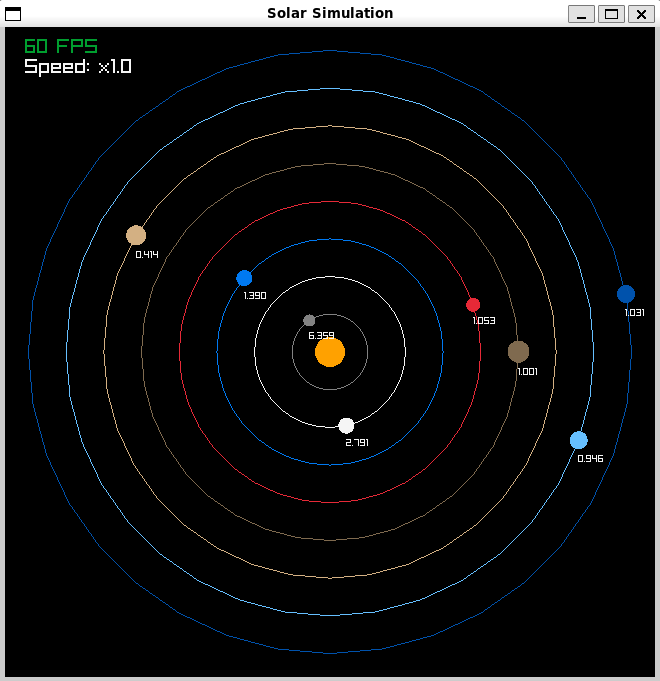

# Solar System Simulation

A simple solar system simulation using [raylib][_raylib].



## Speed Control

- Key <kbd>=</kbd>: Speed up (max is 5)
- Key <kbd>-</kbd>: Slow down (min is 0)

## Building the Solar!

- [Git][_git]
- [Cmake (3.12+)][_cmake]
- C compiler (MSVC, gcc, clang)

### Build instructions

1. Clone the repository

```sh
git clone https://github.com/babiabeo/solar-sim.git
```

2. Build it

```sh
cmake -B build
cmake --build build -j
```

3. Run

```sh
./build/solar_sim
# or ./build/Release/solar_sim
# or ./build/Debug/solar_sim
```

4. Enjoy!

## License

[MIT License](./LICENSE)

[_raylib]: https://github.com/raysan5/raylib
[_git]: https://git-scm.com/
[_cmake]: https://cmake.org/
